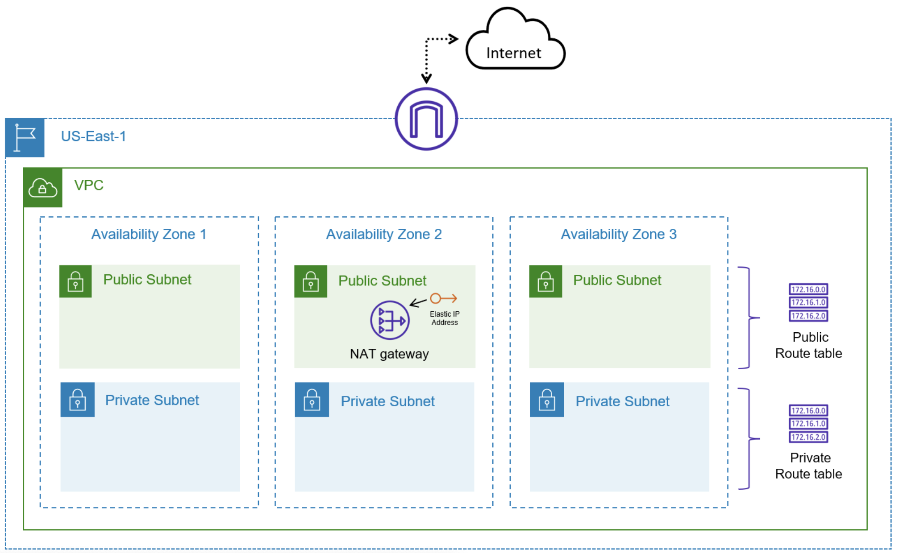

# AWS Infrastructure Project with Terraform

This project was created **solely for learning and practice purposes** to explore how to provision AWS infrastructure using **Terraform**.

---

## 📌 What does this project include?

- Custom VPC
- Public and private subnets distributed across multiple Availability Zones
- Internet Gateway (IGW) for public subnet internet access
- NAT Gateway in a public subnet with an Elastic IP
- Route tables and subnet associations for public and private subnets

---

## 🧱 Architecture Overview

The infrastructure follows a typical **three-tier VPC design** in the **us-east-1** region:

- Each **Availability Zone (AZ)** includes:
  - One **public subnet** (internet-facing)
  - One **private subnet** (internal traffic only)
- A single **NAT Gateway** is placed in one public subnet to allow outbound internet traffic from private subnets.
- Public subnets route traffic to the **Internet Gateway**.
- Private subnets route traffic to the **NAT Gateway**.

---

## 🖼️ Architecture Diagram

---

## ⚙️ Prerequisites

To run this project, you need:

- An active AWS account
- Terraform installed (`>= 1.0.0`)
- AWS CLI insta
